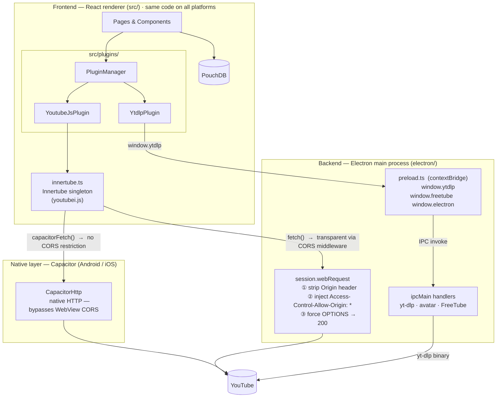

# NeoTube — Architecture Diagram

## Frontend vs backend

| Layer | What runs there |
|-------|----------------|
| **Frontend** (renderer / WebView) | All React UI, PluginManager, PouchDB, YoutubeJsPlugin, YtdlpPlugin, Innertube client (`innertube.ts`) |
| **Electron backend** (main process) | `session.webRequest` CORS middleware, yt-dlp IPC, avatar download IPC, FreeTube import IPC |
| **Capacitor native** | `CapacitorHttp` — native HTTP plugin, no WebView CORS restrictions |

## Key design points

- **youtube.js runs in the frontend on every platform.** CORS is solved at the platform layer, not by moving code to the backend: Electron intercepts HTTP responses in the main process to inject CORS headers; Capacitor routes requests through native HTTP.

- **`src/plugins/youtubejs/innertube.ts`** — detects the platform at runtime and passes a `CapacitorHttp` fetch wrapper to the Innertube constructor on mobile. On Electron the default `fetch` is used (CORS already fixed).

- **yt-dlp stays backend-only.** It's a local binary that can only be invoked from the Electron main process, so it remains behind an IPC bridge (`window.ytdlp → preload → ipcMain`).

## Platform feature matrix

| Feature | Electron | Android / iOS | Web |
|---------|----------|---------------|-----|
| youtube.js (Innertube) | ✅ frontend + session CORS | ✅ frontend + CapacitorHttp | ⚠️ CORS blocked |
| yt-dlp | ✅ IPC → local binary | ❌ | ❌ |
| PouchDB local storage | ✅ | ✅ | ✅ |
| P2P sync | ✅ | ✅ | ✅ |
