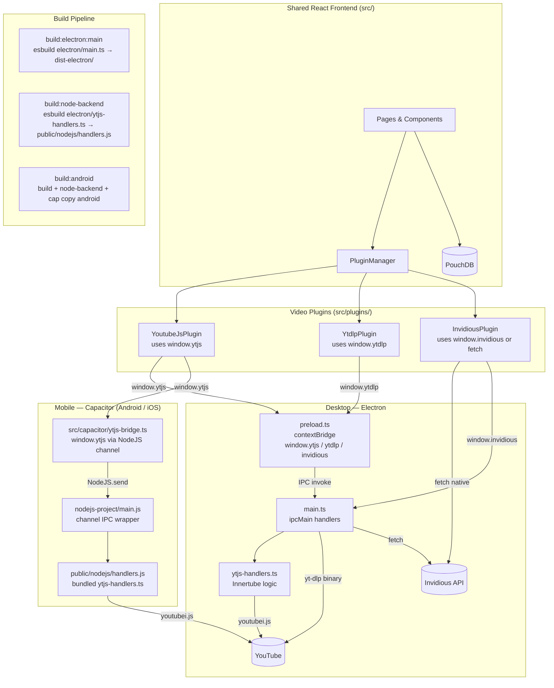

# NeoTube — Architecture Diagram

## Key reuse points

- **`electron/ytjs-handlers.ts`** — single source of truth for all Innertube / youtubei.js logic.
  Built into the Electron main process bundle and separately bundled into
  `public/nodejs/handlers.js` for the Android/iOS Node.js thread.

- **`src/plugins/youtubejs/index.ts`** — unchanged across platforms; reads `window.ytjs`
  regardless of whether it was set by the Electron preload or the Capacitor bridge.

- **All React UI, routing, PouchDB, and plugin interfaces** — fully shared across
  Electron, Android, iOS, and the web build.

## Platform feature matrix

| Feature | Electron | Android / iOS | Web |
|---------|----------|---------------|-----|
| youtube.js (Innertube) | ✅ IPC → main process | ✅ capacitor-nodejs thread | ❌ |
| yt-dlp | ✅ IPC → local binary | ❌ | ❌ |
| Invidious | ✅ IPC fetch (no CORS) | ⚠️ direct fetch (CORS varies) | ⚠️ direct fetch (CORS varies) |
| PouchDB local storage | ✅ | ✅ | ✅ |
| P2P sync | ✅ | ✅ | ✅ |
