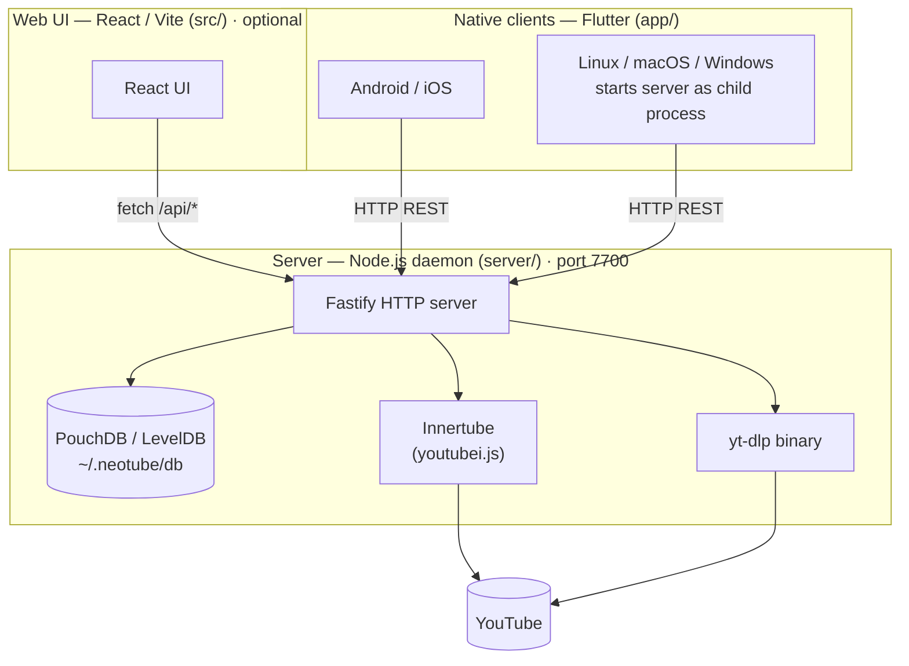

# NeoTube — Development Guide

## Overview

NeoTube is a free, open source, privacy-respecting YouTube client. It allows users to browse and watch YouTube content without being tracked by Google.

---

## Architecture

NeoTube uses a **client–server model**. A standalone Node.js server (Fastify + PouchDB + youtubei.js + yt-dlp) runs on the user's machine or LAN and exposes a REST API. Native client apps (Flutter on Linux/mobile/desktop) are thin HTTP clients that call the API and render results. A React/Vite web UI (`src/`) can also connect to the same API, and an Electron wrapper (`electron/`) packages it as a desktop stop-gap.

### System diagram



### Layer responsibilities

| Layer | What runs there |
|-------|----------------|
| **Server** | Fastify REST API, PouchDB storage, Innertube (youtubei.js), yt-dlp spawn |
| **Flutter** (primary clients) | Dart app, HTTP client, video playback, native UI; Linux build spawns the server as a child process |
| **React web UI** (`src/`) | Optional browser-based client; calls the same REST API |

### Key design points

- **youtube.js lives on the server.** It's a JS library that needs a real Node.js environment (no CORS, no WebView sandboxing). Flutter clients are pure Dart — they receive structured JSON from the API.
- **yt-dlp is server-side only.** The binary is spawned from the Fastify process; clients call `/api/video/:id?backend=ytdlp`.
- **PouchDB is the server's source of truth.** Subscriptions, history, settings, and channel caches are stored in LevelDB via PouchDB. The `/api/sync` endpoint triggers one-shot replication to a CouchDB-compatible remote (optional).
- **Flutter Linux spawns the server.** `lib/services/server_manager.dart` starts the Fastify process as a child on launch (using `$NEOTUBE_SERVER_PATH`) and kills it on exit. Mobile and remote-desktop users configure an external server URL in Settings.

### REST API contract

```
# Video & search
GET  /api/video/:id?backend=youtubejs|ytdlp
GET  /api/search?q=&limit=&backend=

# Channel
GET  /api/channel/:id?backend=
GET  /api/channel/:id/videos?limit=&backend=
GET  /api/channel/:id/playlists?backend=
GET  /api/channel-cache/:channelId          (cached video list)
PUT  /api/channel-cache/:channelId          body: CachedVideo[]

# Storage
GET    /api/settings
PATCH  /api/settings                        body: Partial<UserSettings>
GET    /api/subscriptions
POST   /api/subscriptions                   body: { channelId, name, thumbnail? }
DELETE /api/subscriptions/:channelId
GET    /api/subscriptions/:channelId/status
GET    /api/history
POST   /api/history                         body: { videoId, title, channelId, channelName, thumbnail?, duration? }
DELETE /api/history/:videoId
DELETE /api/history                         (clear all)

# Utilities
GET    /api/proxy?url=                      streams image bytes (YouTube hosts only)
POST   /api/sync                            body: { remoteUrl } — PouchDB replication
GET    /api/health                          → { ok: true, version }
```

---

## Platform Targets

| Platform | Stack |
|----------|-------|
| Mobile (primary) | Flutter → iOS / Android |
| Desktop (primary) | Flutter → Linux / macOS / Windows |
| Desktop (stop-gap) | Electron + React (`src/`) |

---

## Directory Structure

```
NeoTube/
├── server/                    # Standalone Node.js REST API server
│   └── src/
│       ├── index.ts           # Fastify instance, CORS, optional API key, startup
│       ├── db.ts              # PouchDB CRUD (settings, subscriptions, history, cache)
│       ├── innertube.ts       # Innertube singleton (youtube.js)
│       ├── ytdlp.ts           # yt-dlp spawn helpers
│       ├── types.ts           # Shared response types
│       └── routes/
│           ├── video.ts       # /api/search, /api/video/:id
│           ├── channel.ts     # /api/channel/* + channel cache
│           ├── subscriptions.ts
│           ├── history.ts
│           ├── settings.ts
│           ├── proxy.ts       # /api/proxy?url= — image proxy
│           └── sync.ts        # /api/sync — PouchDB replication
│
├── app/                       # Flutter native UI (Linux, iOS, Android, macOS, Windows)
│   ├── pubspec.yaml
│   ├── linux/                 # GTK3 runner (window title, size, background colour)
│   └── lib/
│       ├── main.dart          # Entry point; starts server subprocess on desktop
│       ├── router.dart        # go_router config + bottom-nav shell
│       ├── api/
│       │   └── client.dart    # NeoTubeClient — typed wrappers around every API endpoint
│       ├── models/
│       │   └── models.dart    # Dart models mirroring server/src/types.ts
│       ├── providers/
│       │   └── providers.dart # Riverpod providers (server URL, API client, settings, subs, history)
│       ├── services/
│       │   └── server_manager.dart  # Spawns/stops the Node.js server on desktop
│       ├── screens/
│       │   ├── home/          # Subscription feed
│       │   ├── search/        # Search with live results
│       │   ├── watch/         # Video player (chewie/video_player) + subscribe button
│       │   ├── channel/       # Channel header + Videos/Playlists tabs
│       │   ├── subscriptions/ # Subscribed channel list
│       │   ├── history/       # Watch history grid
│       │   └── settings/      # Server URL + cookie + backend selector
│       └── widgets/
│           ├── video_card.dart          # Video list item
│           └── async_value_widget.dart  # Generic loading/error/data wrapper
│
├── src/                       # React web UI (optional — calls the same REST API)
│   ├── components/
│   ├── pages/
│   ├── plugins/               # Plugin system (youtubejs + ytdlp) — calls /api/*
│   ├── db/                    # PouchDB access layer (browser)
│   └── …
│
├── shell.nix                  # Nix dev shell: nodejs_22, flutter, jdk17, yt-dlp
├── flake.nix                  # Nix flake
└── package.nix                # Nix package definition
```

---

## Tech Stack

| Concern | Technology |
|---------|-----------|
| Server framework | Fastify 5 |
| Server DB | PouchDB 9 (LevelDB via `pouchdb`) |
| YouTube data | youtubei.js 17 |
| Video download | yt-dlp |
| Native UI | Flutter 3 + Dart |
| State management | flutter_riverpod |
| Navigation | go_router |
| Video playback | video_player + chewie |
| Desktop stop-gap | Electron + React 19 |
| React bundler | Vite 8 |
| React routing | React Router 7 |
| React testing | Vitest + Testing Library |
| Linting | oxlint |
| Dev environment | Nix (flake + shell.nix) |

---

## Running Locally

```bash
# Enter Nix dev shell (provides node, flutter, yt-dlp, electron)
nix-shell

# Start the REST API server
cd server && npm install && npm run dev
# → http://localhost:7700

# Run Flutter app (choose a device)
cd app && flutter pub get && flutter run

# Or run the Electron stop-gap
npm install && npm run dev:electron
```

---

## Features

### Playback
- Video playback via pluggable backend (yt-dlp or youtube.js)
- Quality selection from available streams
- Watch page: title, channel link, subscribe button, view count, collapsible description
- YouTube cookie auth (Settings → YouTube Account): paste session cookie to unlock 720p+ adaptive streams via youtube.js

### Search & Browse
- Universal topbar: video URL → Watch, channel URL → Channel page, search term → results
- Search results with thumbnail, duration, channel name (linked), view count
- Previously-watched indicator on search results (normal / dim / hide, per Settings)
- Channel page: avatar, name, subscriber count, collapsible description, subscribe button
- Channel page tabs: Videos and Playlists
- Previously-watched indicator on channel video grid

### Subscriptions
- Subscribe / unsubscribe from Watch page and Channel page
- Subscriptions stored in PouchDB (server-side); sorted alphabetically
- **Subscriptions feed** (`/subscriptions`): recent videos from all subscribed channels
- **Channels grid** (`/channels`): card grid of subscribed channels

### Watch History
- Every watched video is recorded to PouchDB
- History page: responsive grid, relative timestamps, per-video remove, clear all
- Previously-watched video style (Normal / Dim / Hide) in Settings

### Data Import
- **FreeTube import** (Electron, Desktop only): imports subscriptions and watch history

### Settings
- Light / dark theme
- Active backend selector (yt-dlp, youtube.js)
- Previously watched video style (Normal / Dim / Hide)
- YouTube session cookie: stored in PouchDB, restored on server startup
- Server URL configuration (Flutter app)

---

## Privacy Model

_To be defined._

---

## Roadmap

### Phase 1 — Foundation ✓
- [x] Nix dev environment (flake, shell.nix, package.nix)
- [x] Vite + React + TypeScript scaffold
- [x] React Router with page skeleton
- [x] PouchDB data layer + types
- [x] Settings stored in PouchDB (theme, quality, privacy mode)
- [x] Light / dark theme toggle
- [x] Electron skeleton (main + preload)
- [x] Capacitor config

### Phase 2 — Plugin System & yt-dlp ✓
- [x] `VideoPlugin` interface
- [x] `PluginManager` with registration, lookup, and auto-select
- [x] yt-dlp plugin — Electron IPC bridge to local binary
- [x] VideoPlayer component with quality selector
- [x] Watch page wired to active plugin

### Phase 3 — youtube.js Plugin ✓
- [x] youtube.js plugin — runs in renderer; CORS via `session.webRequest` on Electron, `CapacitorHttp` on mobile
- [x] YouTube cookie auth for 720p+ adaptive streams
- [x] Plugin selector in Settings page

### Phase 4 — Search & Browse ✓
- [x] Topbar search (URL → Watch, query → Search results)
- [x] Search results page with thumbnail, duration, channel
- [x] Channel page with avatar, subscriber count, subscribe button
- [x] Channel page Videos and Playlists tabs

### Phase 5 — Subscriptions & History ✓
- [x] Subscribe / unsubscribe
- [x] Subscriptions stored in PouchDB
- [x] Subscription feed and Channels grid pages
- [x] Watch history stored in PouchDB
- [x] History page with grid, timestamps, remove, clear all
- [x] Previously-watched style setting

### Phase 6 — Data Import ✓ (partial)
- [x] FreeTube import (subscriptions + watch history, Desktop only)
- [ ] OPML / CSV subscription export
- [ ] Generic watch history export

### Phase 6.5 — UI Component System ✓
- [x] Centralised `Button`, `MenuButton`, `ToggleButton`, `VideoCard`, `VideoThumbnail` components
- [x] `src/utils/format.ts` — shared `formatDuration` + `timeAgo`
- [x] `src/services/videoCache.ts` — stale-while-revalidate cache

### Phase 7 — REST API Server ✓
- [x] Fastify server in `server/` — video, channel, subscriptions, history, settings, proxy, sync routes
- [x] PouchDB (LevelDB) persistence on server
- [x] Innertube singleton on server (no CORS, no workarounds)
- [x] Optional API key authentication
- [x] Image proxy endpoint (`/api/proxy`)
- [x] PouchDB → CouchDB sync endpoint (`/api/sync`)
- [x] Health check endpoint

### Phase 8 — Flutter Native UI (in progress)
- [x] Flutter project scaffold (`app/`)
- [x] `NeoTubeClient` — typed Dart HTTP client for all API endpoints
- [x] Riverpod providers (server URL, API client, settings, subscriptions, history)
- [x] All screens: Home (feed), Search, Watch, Channel, Subscriptions, History, Settings
- [x] `VideoCard` widget, `AsyncValueWidget` generic wrapper
- [x] go_router with bottom navigation shell
- [x] Linux platform files generated (`app/linux/` GTK3 runner)
- [x] Window title "NeoTube", size 1280×800, centred on launch
- [x] `ServerManager` — spawns/terminates the Fastify server as a child process on Linux desktop
- [x] Electron desktop stop-gap retained (`electron/`, `capacitor.config.ts`, `package.json` deps)
- [ ] Flutter test suite passes (`flutter test`)
- [ ] Android native project (`flutter build apk`)
- [ ] iOS native project (`flutter build ipa`)
- [ ] Video player polish (fullscreen, quality selector)
- [ ] Playback progress persistence
- [ ] mDNS server auto-discovery

### Phase 9 — Production Hardening
- [ ] Flutter Linux: `.desktop` entry file + icon for system integration
- [ ] Flutter Linux: bundle server + node binary alongside the app for distribution
- [ ] Server: systemd service unit file
- [ ] Privacy mode (no history stored)
- [ ] Default quality preference
- [ ] P2P sync between devices via PouchDB replication
