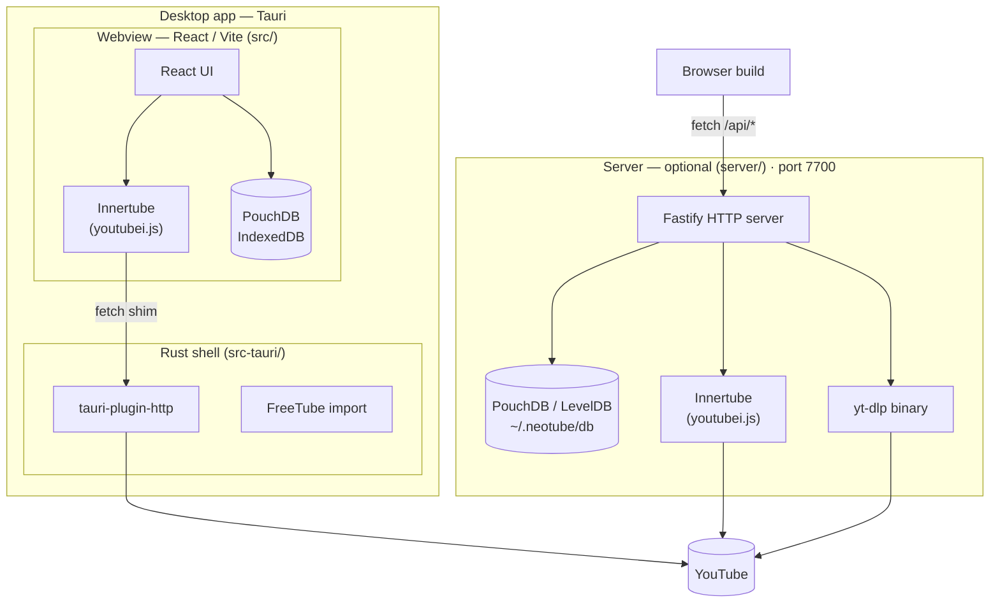

# NeoTube — Development Guide

## Overview

NeoTube is a free, open source, privacy-respecting YouTube client. It allows users to browse and watch YouTube content without being tracked by Google.

---

## Architecture

NeoTube ships as a **self-contained Tauri desktop app**. The React/Vite UI (`src/`) runs in the platform webview, talks to YouTube directly through youtubei.js, and stores its data in PouchDB. A Rust shell (`src-tauri/`) provides the window, the HTTP stack, and the handful of native capabilities the webview lacks.

A standalone Node.js server (`server/`) also exists and exposes the same capabilities over REST. It is **optional** — used by the browser build and for LAN/self-hosted setups. The desktop app does not require it.

### System diagram



### Layer responsibilities

| Layer | What runs there |
|-------|----------------|
| **Webview** (`src/`) | React UI, youtubei.js, PouchDB — the whole app |
| **Rust shell** (`src-tauri/`) | Window, HTTP stack (CORS bypass), FreeTube import |
| **Server** (`server/`) | Optional REST API for the browser build and self-hosting; Innertube + yt-dlp + LevelDB |

### Key design points

- **youtube.js runs in the webview.** The desktop app has no server dependency for YouTube data.
- **CORS is bypassed via Rust, not header rewriting.** `tauri-plugin-http` performs requests outside the webview, so its CORS rules never apply. The single seam is `Innertube.create({ fetch })` in `src/plugins/youtubejs/innertube.ts`.
- **`Origin` must be pinned, not stripped.** InnerTube answers `403` to any cross-origin `Origin` value (an empty one included), so `src/utils/tauri.ts` sets `Origin`/`Referer` to `https://www.youtube.com`. Deleting them does not work: `@tauri-apps/plugin-http` builds its own `Request` internally and merges the webview's headers back in for any key the caller left unset. See `tests/tauriFetch.test.ts`.
- **yt-dlp is server-side only.** The desktop client uses youtubei.js exclusively; the binary is still spawned by the Fastify process for `/api/video/:id?backend=ytdlp`.
- **Adaptive streams need a proxy.** `googlevideo.com` serves cross-origin segment requests but returns no `Access-Control-Allow-Origin`, so the webview blocks the response before dash.js can read it. `src-tauri/src/stream.rs` registers a `ytstream://` scheme that proxies segments and adds the missing header; `toDash({ url_transformer })` rewrites the manifest to use it.
- **The IOS Innertube client is used for playback.** It is the only one returning stream URLs that need no signature deciphering — WEB/ANDROID/TV all require running YouTube's player script in a JS evaluator we don't ship.
- **Cached data is only refetched when stale.** Each channel cache carries a
  `fetchedAt`; `getStaleChannelIds()` filters to expired entries (30 min TTL) so
  revisiting the feed is a pure DB read. Refreshing all 32 channels on every visit
  was the single largest page-load cost.
- **Thumbnails are URLs, never inlined.** They used to be downloaded and stored as
  base64, costing 256 requests per feed refresh and leaving a ~75 MB database that
  slowed every query. `` fetches only what is on screen.
  `stripInlinedThumbnails()` migrates existing data on startup.
- **Channel uploads are paginated.** YouTube returns 30 videos per response;
  `getChannelVideos()` follows continuations (capped at 100 pages) and reports each
  page so the grid fills progressively.
- **Native capabilities live in Rust.** The FreeTube importer needs filesystem access the webview lacks, so it is a `#[tauri::command]` in `src-tauri/src/freetube.rs`. Pages feature-detect via `isTauri()` and degrade gracefully in the browser.
- **One fetch shim serves desktop and mobile.** Tauri v2 targets Android/iOS with the same Rust HTTP stack, so no per-platform branch is needed.

### REST API contract

```
# Video & search
GET  /api/video/:id?backend=youtubejs|ytdlp
GET  /api/search?q=&limit=&backend=

# Channel
GET  /api/channel/:id?backend=
GET  /api/channel/:id/videos?limit=&backend=
GET  /api/channel/:id/playlists?backend=
GET  /api/channel-cache/:channelId          (cached video list)
PUT  /api/channel-cache/:channelId          body: CachedVideo[]

# Storage
GET    /api/settings
PATCH  /api/settings                        body: Partial<UserSettings>
GET    /api/subscriptions
POST   /api/subscriptions                   body: { channelId, name, thumbnail? }
DELETE /api/subscriptions/:channelId
GET    /api/subscriptions/:channelId/status
GET    /api/history
POST   /api/history                         body: { videoId, title, channelId, channelName, thumbnail?, duration? }
DELETE /api/history/:videoId
DELETE /api/history                         (clear all)

# Utilities
GET    /api/proxy?url=                      streams image bytes (YouTube hosts only)
POST   /api/sync                            body: { remoteUrl } — PouchDB replication
GET    /api/health                          → { ok: true, version }
```

---

## Platform Targets

| Platform | Stack |
|----------|-------|
| Desktop | Tauri + React (`src/`) → Linux / macOS / Windows |
| Web | React (`src/`) in the browser → any modern browser (requires the server) |
| Mobile | Tauri v2 (Android / iOS) — scaffolding present, not yet initialised |

---

## Directory Structure

```
NeoTube/
├── server/                    # Standalone Node.js REST API server
│   └── src/
│       ├── index.ts           # Fastify instance, CORS, optional API key, startup
│       ├── db.ts              # PouchDB CRUD (settings, subscriptions, history, cache)
│       ├── innertube.ts       # Innertube singleton (youtube.js)
│       ├── ytdlp.ts           # yt-dlp spawn helpers
│       ├── types.ts           # Shared response types
│       └── routes/
│           ├── video.ts       # /api/search, /api/video/:id
│           ├── channel.ts     # /api/channel/* + channel cache
│           ├── subscriptions.ts
│           ├── history.ts
│           ├── settings.ts
│           ├── proxy.ts       # /api/proxy?url= — image proxy
│           └── sync.ts        # /api/sync — PouchDB replication
│
├── src-tauri/                 # Tauri desktop shell (Rust)
│   ├── src/
│   │   ├── main.rs            # Binary entry point
│   │   ├── lib.rs             # Builder — registers plugins and commands
│   │   ├── freetube.rs        # FreeTube import (filesystem access)
│   │   └── stream.rs          # ytstream:// media segment proxy (CORS)
│   ├── capabilities/          # Permission scopes (allow-listed HTTP hosts)
│   ├── tauri.conf.json        # Window, CSP, bundle config
│   └── Cargo.toml
│
├── src/                       # React UI — the app itself (webview + browser)
│   ├── App.tsx                # React Router routes + Layout shell
│   ├── components/            # Shared UI (Button, VideoCard, PageLayout, …)
│   ├── pages/                 # Search, Watch, Channel, Subscriptions, Channels, History, Settings
│   ├── plugins/               # Plugin system (youtubejs)
│   ├── db/                    # PouchDB access layer (browser)
│   ├── utils/tauri.ts         # Tauri detection, fetch shim, native bridges
│   ├── contexts/ hooks/ services/ types/
│   └── …
│
├── shell.nix                  # Nix dev shell: nodejs_22, rust, tauri-cli, webkitgtk
├── flake.nix                  # Nix flake
└── package.nix                # Nix package definition
```

---

## Tech Stack

| Concern | Technology |
|---------|-----------|
| Server framework | Fastify 5 |
| Server DB | PouchDB 9 (LevelDB via `pouchdb`) |
| YouTube data | youtubei.js 17 |
| Video download | yt-dlp (server only) |
| Client UI | React 19 |
| Adaptive playback | dash.js 5 (MSE) |
| Desktop shell | Tauri 2 (Rust + WebKitGTK / WKWebView / WebView2) |
| React bundler | Vite 8 |
| React routing | React Router 7 |
| React testing | Vitest + Testing Library |
| Linting | oxlint |
| Dev environment | Nix (flake + shell.nix) |

---

## Running Locally

```bash
# Enter Nix dev shell (provides node, rust, tauri-cli, webkitgtk, yt-dlp)
nix-shell

# Run the Tauri desktop app — this is the whole app, no server needed
npm install && npm run tauri:dev

# Optional: the REST API server (needed only for the browser build)
cd server && npm install && npm run dev
# → http://localhost:7700

# Optional: the React UI in the browser (points at the server above)
npm run dev
```

> The dev server is pinned to port 5173 (`strictPort`) because `src-tauri/tauri.conf.json`
> points at that exact URL. A clash fails loudly rather than leaving Tauri on a blank page.

---

## Features

### Playback
- Adaptive DASH playback up to 2160p via dash.js — YouTube only muxes video+audio to 360p, so higher qualities arrive as separate streams
- Quality dropdown overlaid on the player (Auto + every available resolution)
- Fullscreen toggle (button or double-click)
- Quality selection from available streams
- Watch page: title, channel link, subscribe button, view count, collapsible description
- YouTube cookie auth (Settings → YouTube Account): paste session cookie to unlock 720p+ adaptive streams via youtube.js

### Search & Browse
- Universal topbar: video URL → Watch, channel URL → Channel page, search term → results
- Search results with thumbnail, duration, channel name (linked), view count
- Previously-watched indicator on search results (normal / dim / hide, per Settings)
- Channel page: avatar, name, subscriber count, collapsible description, subscribe button
- Channel page tabs: Videos and Playlists
- Previously-watched indicator on channel video grid

### Subscriptions
- Subscribe / unsubscribe from Watch page and Channel page
- Subscriptions stored in PouchDB; sorted alphabetically
- **Subscriptions feed** (`/subscriptions`): recent videos from all subscribed channels
- **Channels grid** (`/channels`): card grid of subscribed channels

### Watch History
- Every watched video is recorded to PouchDB
- History page: responsive grid, relative timestamps, per-video remove, clear all
- Previously-watched video style (Normal / Dim / Hide) in Settings

### Data Import
- **FreeTube import** (desktop only): imports subscriptions and watch history

### Settings
- Light / dark theme
- Startup page (Subscriptions / Channels / History)
- Previously watched video style (Normal / Dim / Hide)
- YouTube session cookie: stored in PouchDB, restored on startup

---

## Privacy Model

_To be defined._

---

## Roadmap

### Phase 1 — Foundation ✓
- [x] Nix dev environment (flake, shell.nix, package.nix)
- [x] Vite + React + TypeScript scaffold
- [x] React Router with page skeleton
- [x] PouchDB data layer + types
- [x] Settings stored in PouchDB (theme, quality, privacy mode)
- [x] Light / dark theme toggle
- [x] Desktop shell skeleton

### Phase 2 — Plugin System ✓
- [x] `VideoPlugin` interface
- [x] `PluginManager` with registration, lookup, and auto-select
- [x] yt-dlp plugin (later removed from the client; still available server-side)
- [x] VideoPlayer component with quality selector
- [x] Watch page wired to active plugin

### Phase 3 — youtube.js Plugin ✓
- [x] youtube.js plugin — runs in the webview; CORS bypassed via Tauri's Rust HTTP stack
- [x] YouTube cookie auth for 720p+ adaptive streams
- [x] Plugin selector in Settings page

### Phase 4 — Search & Browse ✓
- [x] Topbar search (URL → Watch, query → Search results)
- [x] Search results page with thumbnail, duration, channel
- [x] Channel page with avatar, subscriber count, subscribe button
- [x] Channel page Videos and Playlists tabs

### Phase 5 — Subscriptions & History ✓
- [x] Subscribe / unsubscribe
- [x] Subscriptions stored in PouchDB
- [x] Subscription feed and Channels grid pages
- [x] Watch history stored in PouchDB
- [x] History page with grid, timestamps, remove, clear all
- [x] Previously-watched style setting

### Phase 6 — Data Import ✓ (partial)
- [x] FreeTube import (subscriptions + watch history, Desktop only)
- [ ] OPML / CSV subscription export
- [ ] Generic watch history export

### Phase 6.5 — UI Component System ✓
- [x] Centralised `Button`, `MenuButton`, `ToggleButton`, `VideoCard`, `VideoThumbnail` components
- [x] `src/utils/format.ts` — shared `formatDuration` + `timeAgo`
- [x] `src/services/videoCache.ts` — stale-while-revalidate cache

### Phase 7 — REST API Server ✓
- [x] Fastify server in `server/` — video, channel, subscriptions, history, settings, proxy, sync routes
- [x] PouchDB (LevelDB) persistence on server
- [x] Innertube singleton on server (no CORS, no workarounds)
- [x] Optional API key authentication
- [x] Image proxy endpoint (`/api/proxy`)
- [x] PouchDB → CouchDB sync endpoint (`/api/sync`)
- [x] Health check endpoint

### Phase 8 — Tauri Desktop App ✓
- [x] Tauri shell (`src-tauri/`) hosting the React UI — replaced the Electron shell
- [x] All pages: Search, Watch, Channel, Subscriptions, Channels, History, Settings
- [x] FreeTube import as a Rust command (`src-tauri/src/freetube.rs`)
- [x] youtube.js is the client's only backend; yt-dlp and Capacitor removed
- [x] Adaptive DASH playback up to 2160p (dash.js + `ytstream://` segment proxy)
- [x] Quality dropdown and fullscreen toggle overlaid on the player
- [x] Home page removed; startup page is configurable in Settings
- [x] Channel pages load every video via continuations, not just the first 30
- [x] Video card overflow menu: mark as watched, open in YouTube, copy link
- [x] Channel about text always visible (no longer collapsed)
- [x] Feed caching with a TTL; thumbnails stored as URLs (DB ~75 MB → <1 MB)
- [x] `Origin`/`Referer` pinning so InnerTube stops answering 403 (`src/utils/tauri.ts`)

### Phase 9 — Production Hardening
- [ ] Tauri: package installers (AppImage / deb / dmg / msi) via `npm run tauri:build`
- [ ] Tauri mobile: `tauri android init` + Android SDK/NDK in `shell.nix`
- [ ] Verify 1080p+ playback end to end in the app window
- [ ] Server: systemd service unit file
- [ ] Privacy mode (no history stored)
- [ ] Default quality preference
- [ ] P2P sync between devices via PouchDB replication
